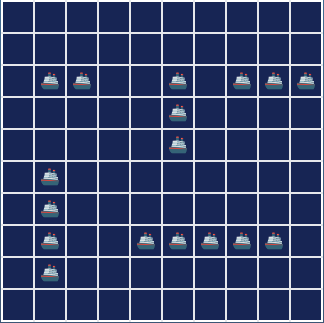
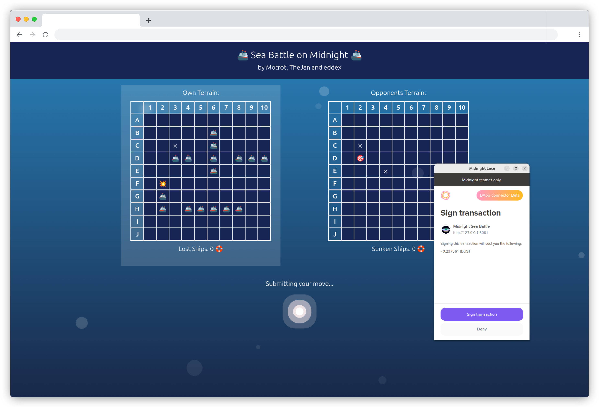
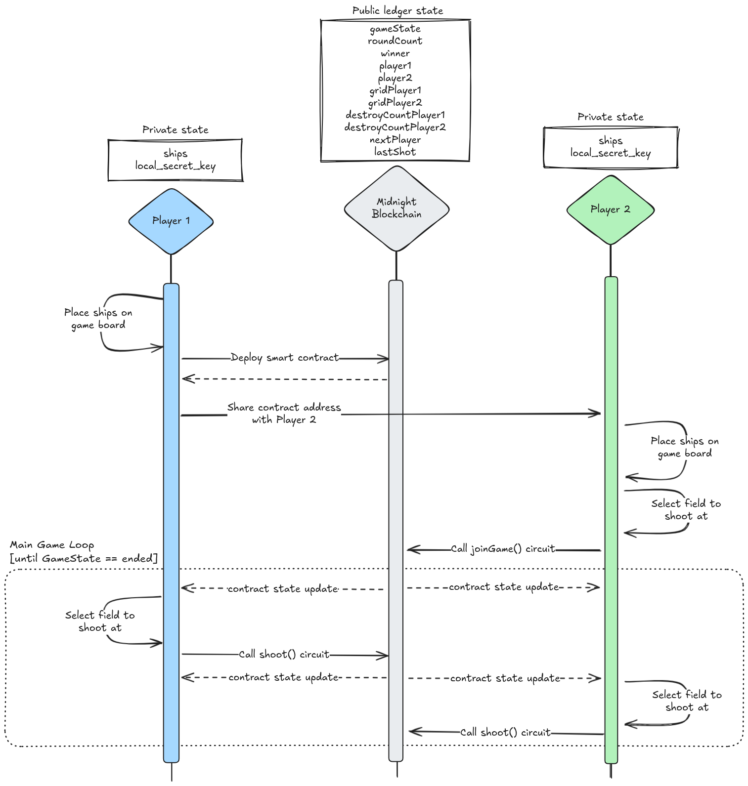
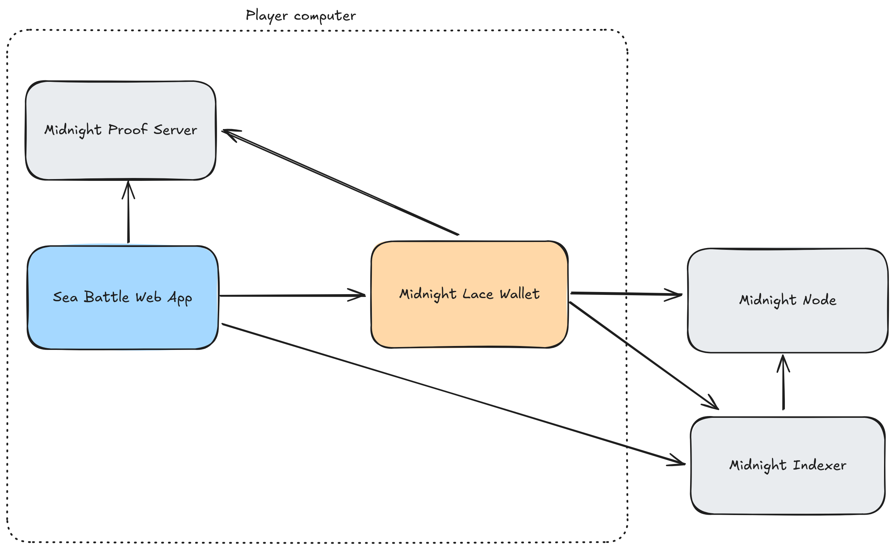

<p align="center"></p>
<h1 align="center"> 🚢 Sea Battle Challenge Virtual Hackathon 🚢</h1>

Our submission for the [Midnight Blockchain Sea Battle Hackathon](https://midnight.brightidea.com/seabattle).



## 💥 What is the Sea Battle Challenge?

This is a classic strategy game between two players. Each player has access to a 10x10 grid-based board. Each player then has to place 5 ships of varying lengths but the same width. The players then take turns giving the coordinates of where they think the other player's ships are. If the player guesses correctly, they have a better chance of guessing the remaining coordinates of the rest of the ships. A ship is sunk once the coordinates of the ship have been given by the opposing player. The game ends when one player no longer has any ships remaining, and the opposing player is crowned the victor.

This version is implemented using a Zero Knowledge Smart Contract (written in Compact) on the Midnight Testnet.

## 🦭 Features

We have implemented the following features:

- ✅ Deploy a new game as Zero Knowledge Smart Contract on the Midnight Chain
- ✅ Join other players contract as a second player
- ✅ Re-Joining own deployed contract (after browser reload / reboot / whatever)
- ✅ Play a game without a game server, just the frontend and the Midnight Chain is needed
- ✅ Prove of the game logic is all done in the Zero Knowledge Smart Contract (written in Compact)

## 📜 Compact Smart Contract

Our compact smart contract can be found in [/src/contract/battleships.compact](/src/contract/battleships.compact).

We made use of _modules_ to extract the logic that validates the players ship placement.
The module can be found in [/src/contract/ships-checker.compact](/src/contract/ships-checker.compact).

### Keeping ship positions secret and immutable

The positions of a players ships are stored in a witness called `ships` to hide this information from the other player.
To prevent players from cheating, a hash of the `ships` data is used as the public key of the players.
This ensures the ships can't be moved throughout the game.
In addition to the `ships` data, each player also has a second witness called `local_secret_key` (random bytes)
which is hashed together with the ship information.
This is needed to prevent players from using a dictionary attack on the hash to figure out the positions of the opponents ships.

```ts
// random secret for the player
witness local_secret_key(): Bytes<32>;

// ships placed on the game board
witness ships(): Vector<5, Vector<2, Vector<2, Uint<8>>>>;
```

### Game flow

When the smart contract is deployed, the player that deploys the contract is assigned as player 1.
Before the deployment player 1 has to place the ships to fill in the data in the `ships` witness.
After deploying the contract player 1 can share the contract address with someone else.

Player 2 can join the game by calling the `joinGame` circuit. This call requires player 2 to also provide
the coordinates of the first field to shoot at on player 1's board.

```ts
export circuit joinGame(targetX: Uint<8>, targetY: Uint<8>): Void { ... }
```

Now the game is set up and the first move has been initiated by player 2.
From now on the players use the `shoot` circuit to take their turns.
The `shoot` cirquit implements the main game logic.

```ts
export circuit shoot(
    isPlayerOneCalling: Boolean,
    targetX: Uint<8>,
    targetY: Uint<8>): Void
    { ... }
```

As soon as the last ship of one of the players is sunk, the game state is updated
to `GAME_STATE.ended` and the winner is stored in the public ledger state of the contract.
At this point the `shoot` circuit will reject any further calls.



## 💻️ Development

### Getting started

1. Follow the official [Midnight Quick Start](https://docs.midnight.network/quickstart/) guide to configure the tools needed for development
2. Clone/download this repo
3. Install dependencies: `npm i`
4. Build the smart contract: `npm run build:contract`
5. Build the frontend: `npm run build`
6. Start the project locally: `npm run serve`

The application will connect to the Midnight Testnet. For development the _simulated mode_ can be activated on the UI which can be used to work on the fontend without using the blockchain.

### Architecture

The Sea Battle web app is a frontend only application that runs in your browser.
It connects to the Midnight Lace Wallet (browser extension) to submit transations.
The proof server is used to calculate the Zero Knowledge proofs for the smart contract calls.
The Midnight Indexer provides blocklchain updates through HTTP/GraphQL and Websocket endpoints.



The game doesn't have a centralized server component making it fully decentralized. All game logic is run on the player's machines and validated by the smart contract.
